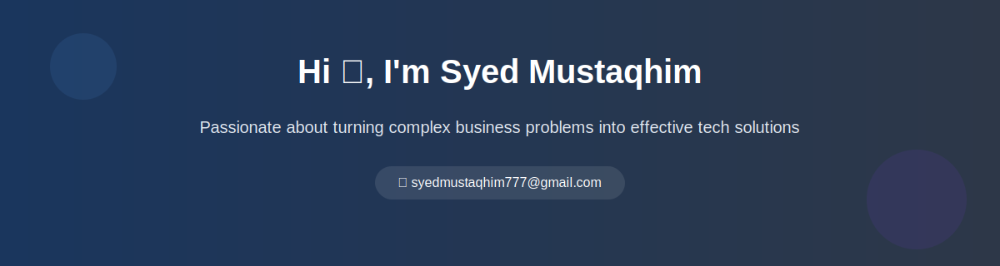

<!-- Profile Cover -->

  

<!-- About Me Section -->
<h2 align="left">About Me 👨‍💻</h2>

I'm a Full Stack Developer and AI/ML Engineer passionate about turning complex business problems into effective tech solutions. I specialize in building scalable applications and implementing AI solutions.

<!-- Full Stack Development Section -->
<h2 align="left">🚀 Full Stack Development</h2>

<table>
  <tr>
    <td align="center" width="96">
      
       JavaScript
    </td>
    <td align="center" width="96">
      
       TypeScript
    </td>
    <td align="center" width="96">
      
       NodeJS
    </td>
    <td align="center" width="96">
      
       NestJS
    </td>
    <td align="center" width="96">
      
       Python
    </td>
  </tr>
  <tr>
    <td align="center" width="96">
      
       React
    </td>
    <td align="center" width="96">
      
       React Native
    </td>
    <td align="center" width="96">
        
       AWS
    </td>
    <td align="center" width="96">
      
       Docker
    </td>
  </tr>
</table>

<!-- AI/ML Section -->
<h2 align="left">🤖 Artificial Intelligence & Machine Learning</h2>

<table>
  <tr>
    <td align="center" width="96">
      
       TensorFlow
    </td>
    <td align="center" width="96">
      
       PyTorch
    </td>
    <td align="center" width="96">
      
       NLP
    </td>
    <td align="center" width="96">
      
       OpenCV
    </td>
    <td align="center" width="96">
      
       LLMs
    </td>
  </tr>
</table>

<!-- Connect Section -->
<h2 align="left">🌐 Connect with me</h2>

  

---

🚀 Open to collaborating on interesting projects.

